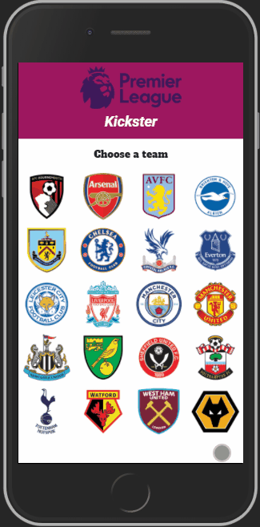

# kickster

A mobile-responsive application for football enthusiasts who want to view the latest English Premier League match results and highlights. This application utilizes APIs from football-data.org, The Guardian, and Google Maps.

## Live demo:

Try the application live at https://kickster.felixchin.com/

## Preview:

## Current Feature List

1. User can select a Premier League team.
2. User can view last 4 match results for a team.
3. User can view match reports for last 4 matches.
4. User can view highlight videos for last 4 matches.
5. User can see stadium location on google maps.
6. User can go back to home screen and select a new team.
7. App is mobile-responsive for iPhone 6/7/8 and iPad, in both portrait and landscape modes.

## Planned Additions

1. Integrate match reports and match results so that they flow together.
2. User can click into a match result to view additional details such as line-ups, match stats, etc.
3. Team pages will have a section that lists the full team roster.
4. User can click a player on the team roster and see individual player stats.

## What I Learned

My biggest take away from this project was finally becoming comfortable with using media queries and Bootstrap 4 to create a mobile responsive website. I also learned to build for mobile first and then layer on code from there to make the app compatible for higher resolution devices.
